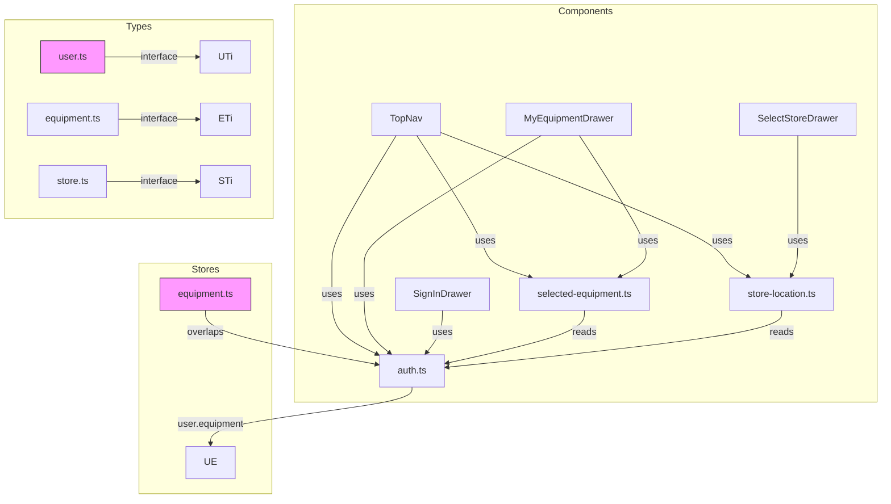
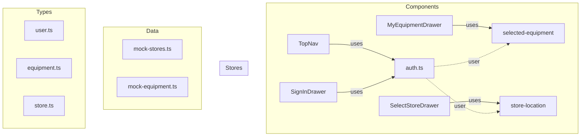

# Codebase Optimization Analysis

## Current State Overview

The project follows a modular structure with:

- **4 stores**: auth, equipment, selected-equipment, store-location
- **4 components**: Drawer, TopNav, SignInDrawer, MyEquipmentDrawer, SelectStoreDrawer
- **3 type files**: user, equipment, store

---

## Issues & Optimizations

### 1. Store Architecture Issues

#### Problem: Redundant/Confusing Store Layering

The `equipment.ts` store creates unnecessary complexity by wrapping the auth store's user equipment data:

```typescript
// Current: equipment.ts creates its own layer over user.equipment
export const equipmentList = derived(equipmentStore, ($store) => {
	const user = get(currentUser);
	if (user && user.equipment) {
		return user.equipment;
	}
	return [];
});
```

**Issue**: This duplicates logic already accessible via `currentUser.equipment`.

**Recommendation**: Simplify to use `currentUser` directly or remove the `equipment.ts` store entirely since:

- `auth.ts` already provides `currentUser` with `equipment` property
- `selected-equipment.ts` already handles selection state
- `equipment.ts` adds no value and creates confusion

#### Problem: Direct Store Mutation in Auth

The auth store directly mutates user object properties:

```typescript
// In auth.ts line 53
user.equipment = [...(user.equipment || []), ...guestEquipment];
```

**Issue**: Mutating a derived store value directly is not idiomatic.

**Recommendation**: Use Svelte's `$state` pattern or proper immutable updates in auth store.

---

### 2. Type Organization

#### Problem: Mixed Concerns in user.ts

The `user.ts` has both the interface and a factory function:

```typescript
// interface at top
export interface UserProfile { ... }

// factory function at bottom
export function createEmptyUserProfile(): UserProfile { ... }
```

**Recommendation**:

- Move factory functions to a separate file or keep only interfaces
- Consider using TypeScript's `satisfies` for validation

#### Problem: Data vs Types Mixed

`DUMMY_STORES` and `DUMMY_EQUIPMENT` should be in data/config files, not in type files.

**Recommendation**: Create:

```
src/lib/data/
  mock-stores.ts
  mock-equipment.ts
```

---

### 3. Component State Management

#### Problem: Inconsistent Store Usage in MyEquipmentDrawer

Uses both local state AND store:

```typescript
// Local state for UI
let selectedEquipment = $state<Equipment | null>(null);

// Store for persistence
selectedEquipmentStore.selectEquipment(equipment);
```

**Recommendation**:

- Use only one source of truth
- Let the store drive the UI state via derived values
- Remove local `selectedEquipment` state and use `$derived($selectedEquipment)` from store

---

### 4. SvelteKit Conventions

#### Issue: Singleton Stores in Non-SvelteKit Pattern

All stores are exported as singletons. This is fine, but consider:

**Recommendation**:

- Group related stores into a single file (e.g., `session.ts` for auth-related)
- Use `svelte/store` writable pattern consistently

#### Issue: No SSR Considerations

The equipment store accesses localStorage directly:

```typescript
if (typeof window !== 'undefined') {
	localStorage.getItem('guest_equipment');
}
```

**Recommendation**: Use `$app/environment` for cleaner SSR checks:

```typescript
import { browser } from '$app/environment';
if (browser) { ... }
```

---

### 5. Dead Code & Unused Exports

#### Issue: Equipment Store Unused Methods

The equipment store has broken/bypassed logic:

```typescript
// This code is unreachable/broken
auth.signIn({ username: user.username, password: '' }).then(() => {
	// This won't work as-is
});
```

**Recommendation**: Remove unused methods or fix the implementation.

---

## Proposed Refactoring Plan

### Phase 1: Type & Data Organization

1. Move mock data from `types/*.ts` → `data/*.ts`
2. Keep interfaces in `types/` only

### Phase 2: Store Simplification

1. Remove `equipment.ts` (or refactor to use only `currentUser`)
2. Keep `selected-equipment.ts` for selection UI state
3. Keep `store-location.ts` for store selection UI state

### Phase 3: Component Refactoring

1. MyEquipmentDrawer: Use `$derived($selectedEquipment)` instead of local state
2. TopNav: Already uses stores correctly

### Phase 4: SSR Improvements

1. Replace `typeof window !== 'undefined'` with `$app/environment`

---

## Mermaid: Current Architecture



---

## Recommended Architecture



---

## Summary

| Priority | Change                        | Effort |
| -------- | ----------------------------- | ------ |
| High     | Remove/fix equipment.ts store | Medium |
| High     | Fix localStorage SSR checks   | Low    |
| Medium   | Move mock data to data/       | Low    |
| Medium   | Fix MyEquipmentDrawer state   | Low    |
| Low      | Group stores into single file | Medium |

The current implementation is functional but has unnecessary complexity. The primary wins come from removing the redundant equipment.ts store and fixing SSR checks.
